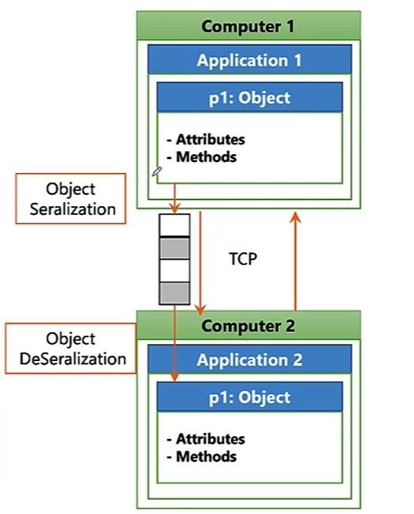

# ORM JDBC JPA Hibernate Spring Data
maaping objet relationnel (correspondance entre => approche `oriente objet`: creer des class ... +
`bases de donnees relationnel`: contenant les tableaux relationnel des donnees)

### EXEMPLE: rechercher des produits Image: 

1. creer class Produit:
```java
public class Produit(
	private Long id;
	private string designation;
	private double prix;
	private int quantite;
	// GETTERS SETTERS
)
```
2. creer table Produits contenant les donnees
| ID | Designation   | Prix | Quantite |
|----|---------------|------|----------|
| 1  | Clavier       | 150  | 12       |
| 2  | Souris Gamer  | 120  | 15       |
| 3  | Casque Audio  | 250  | 10       |

3. creer methode to connect between 1 and 2 we use `api jdbc` JAVA DATABSAE CONNECTIVITY

```java
public List<Produit> findByDesignation(String kw) {
	List<Produit> produits=new ArrayList<Produit>(); //connect between a table data and class
	Class.forName("com.mysql.jdbc.Driver"); //connect to database server MySQL using class/driver
	Connection conn=DriverManager.getConnection ("URL", "username", "psw");
	PreparedStatement ps=conn.preparedStatement("SELCT * FROM PRODUITS WHERE DISIGNATION LIKE ?");
	ps.serString(1, kw);
	ResultSet rs=ps.executeAuery(); //executer a reuqete - ResultSet used to stock results of select query
	while(rs.next()){
		Produit p=new Produit();
		p.setId(rs.getLong("ID"));
		p.setDesignation(rs.getString("DESIGNATION"));
		p.setPrix(rs.getDouble("PRIX"));
		p.setQuantite(rs.getint("QUANTITE"));
		produits.add(p):
	}
	return produits;
}
```

* if u did PreparedStatement ps=conn.preparedStatement("SELCT * FROM PRODUITS WHERE DISIGNATION LIKE" + "'" + "kw" + "'") there s a probability of sql injection to ur code (fail de securite) so u have to do tests concatination if kw contain DROP DLETE ... keywords so best practice is ps.serString(1, keyword)
* instead of using this heavy code we use a framework called HIBERNATE to do object relational mapping 

---

## WHY Hibernate?
- -95% of wasted coding time
- portability of app for example from mysql to oracle
- performance / best practice

all mapping frameworks follow JPA java persistence api used to create interfaces

### EXEMPLE: APP pour gerer les produits `Entity JPA Produit` / `Java Bean`
```java
package dao;

import java.io.Serializable;
import javax.persistence.*;

@Entity //means that this class corresponds to a table in the database which is called `persistent class`
@Table(name="PRODUITS")

public class Produit implements Serializable {
	@Id //means that reference is a primary key
	@GeneratedValue(strategy=GeneratedType.IDENDITY) //identity means incremented id by one
	@Column(name="REF") //means that the variable reference corresponds to column REF in database
	private Long reference;
	@Column(name="DES")
	private string designation;
	private double prix;
	private int quantite;

	//constructors 
	//getters setters
}
```

* serialization prendre un objet de la ram/memoire et de le convertir en un tableau d octet `bits` pour l envoyer a une autre app after that the other application does deserialization prendre le taleau d octets pour construire l objet  
* par defaut entities are converted in format `XML` ou `JSON` between layers of different types/codes/languages

---

